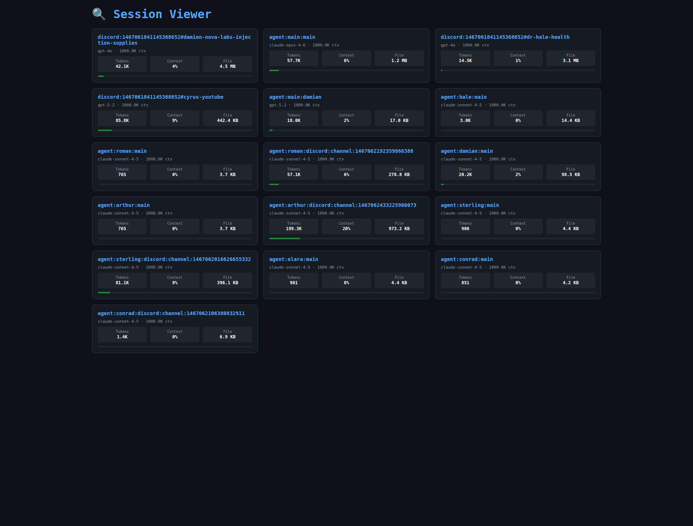
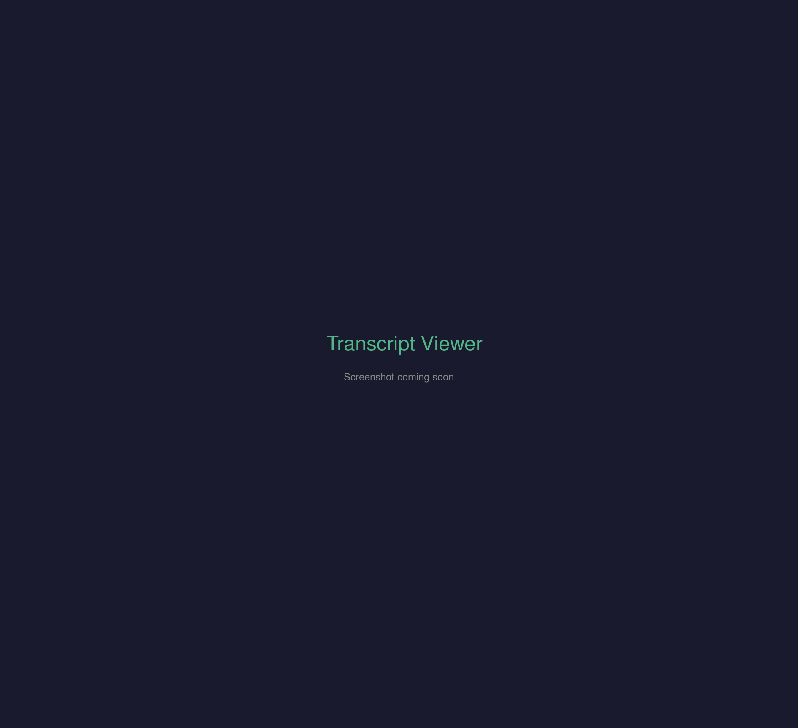

# 🔍 Claw Session Viewer

Real-time web dashboard for monitoring OpenClaw agent sessions. Track token usage, view live transcripts, and debug conversations across all your agents in one place.



---

## 📑 Contents

- [Quick Start](#-quick-start)
- [Features](#-features)
- [Using the Viewer](#-using-the-viewer)
- [Installation](#-installation)
- [Running as a Service](#-running-as-a-service)
- [API Reference](#-api-reference)
- [Requirements](#-requirements)
- [License](#-license)

---

## ⚡ Quick Start

```bash
# Install
pip install flask

# Run
python session-viewer.py

# Open browser
http://localhost:8766
```

That's it! The viewer auto-discovers all OpenClaw sessions from `~/.openclaw/agents/`.

---

## ✨ Features

### Session Monitoring
- 📊 **Multi-agent view** - See all active sessions across every agent
- 💯 **Token tracking** - Real-time context usage with color-coded warnings
- 🎯 **Smart filtering** - Toggle tool calls, focus on conversations
- ⚡ **Live tail mode** - Auto-refresh every 2 seconds for active debugging

### Transcript Viewer
- 🕐 **Timestamps** - See exactly when each message was sent
- 🎨 **Role highlighting** - Color-coded user/assistant/tool entries
- 📏 **Token estimates** - Character count and estimated tokens per entry
- 🔄 **Newest first** - Latest messages at the top, scroll for history

### Technical
- 🚀 **Zero config** - Works out of the box with any OpenClaw setup
- 📦 **Single file** - Just one Python file, no complex installation
- 🌐 **Web-based** - Access from any browser, even mobile
- 🔌 **REST API** - JSON endpoints for custom integrations

---

## 🎯 Using the Viewer

### Understanding the Display

Each session card shows:

| Metric | What it means |
|--------|---------------|
| **Tokens** | Current token count (green < 70%, amber 70-84%, red 85%+) |
| **Context** | Percentage of model's context window used |
| **File** | Session file size on disk |
| **Model** | Which AI model this session is using |

### Viewing Transcripts



1. **Click any session** to open its transcript
2. **Newest messages appear at top** - scroll down for history
3. **Entry colors**:
   - 🔵 **Blue** - User messages
   - 🟢 **Green** - Assistant responses
   - 🟡 **Amber** - Tool calls
   - 🟣 **Purple** - Tool results
   - ⚪ **Gray** - System events

### Controls

- **📡 Live Tail** - Auto-refresh every 2 seconds (great for debugging active conversations)
- **🔄 Refresh** - Manually refresh current transcript
- **Show Tools** - Toggle tool use/result visibility for cleaner reading

---

## 📦 Installation

### Prerequisites

- Python 3.8 or higher
- OpenClaw installed and running
- Active sessions in `~/.openclaw/agents/`

### Step-by-Step

1. **Clone or download** this repo:
   ```bash
   git clone https://github.com/rodbland2021/claw-session-viewer.git
   cd claw-session-viewer
   ```

2. **Install Flask**:
   ```bash
   pip install flask
   # or
   pip install -r requirements.txt
   ```

3. **Run the viewer**:
   ```bash
   python session-viewer.py
   ```

4. **Open your browser**:
   ```
   http://localhost:8766
   ```

### Custom Port

```bash
python session-viewer.py --port 9000
```

### Remote Access

To access from other machines on your network:

```bash
python session-viewer.py --host 0.0.0.0 --port 8766
```

Then open `http://your-server-ip:8766` from any device.

---

## 🔧 Running as a Service

### systemd (Linux)

Create `/etc/systemd/system/session-viewer.service`:

```ini
[Unit]
Description=Claw Session Viewer
After=network.target

[Service]
Type=simple
User=yourusername
WorkingDirectory=/path/to/claw-session-viewer
ExecStart=/usr/bin/python3 session-viewer.py --host 0.0.0.0 --port 8766
Restart=on-failure
RestartSec=10

[Install]
WantedBy=multi-user.target
```

Enable and start:

```bash
sudo systemctl enable session-viewer
sudo systemctl start session-viewer
sudo systemctl status session-viewer
```

### Docker (Optional)

```bash
# Run in container
docker run -d \
  --name session-viewer \
  -p 8766:8766 \
  -v ~/.openclaw:/root/.openclaw:ro \
  -e PYTHONUNBUFFERED=1 \
  python:3.11-slim \
  sh -c "pip install flask && python session-viewer.py --host 0.0.0.0"
```

---

## 🔌 API Reference

The viewer exposes REST endpoints for custom integrations:

### GET `/api/sessions`

Returns all active sessions with metadata.

**Response:**
```json
[
  {
    "key": "agent:main:main",
    "displayName": "Main Agent",
    "totalTokens": 156430,
    "contextTokens": 1000000,
    "inputTokens": 142100,
    "outputTokens": 14330,
    "model": "claude-sonnet-4-5",
    "fileSize": 1153024,
    "updatedAt": 1707289123
  }
]
```

### GET `/api/transcript`

Returns transcript entries for a specific session.

**Parameters:**
- `key` (required) - Session key from `/api/sessions`
- `tools` (optional) - Include tool calls (`true`/`false`, default `true`)

**Response:**
```json
{
  "displayName": "Main Agent",
  "entries": [
    {
      "role": "user",
      "content": "Hello!",
      "chars": 6,
      "estimatedTokens": 1,
      "timestamp": "2026-02-07T10:30:00.000Z",
      "toolName": null
    },
    {
      "role": "assistant",
      "content": "Hi! How can I help you today?",
      "chars": 30,
      "estimatedTokens": 7,
      "timestamp": "2026-02-07T10:30:02.000Z",
      "toolName": null
    }
  ]
}
```

### Example: Custom Integration

```python
import requests

# Get all sessions
sessions = requests.get('http://localhost:8766/api/sessions').json()

# Find high-usage sessions
for session in sessions:
    usage_pct = (session['totalTokens'] / session['contextTokens']) * 100
    if usage_pct > 80:
        print(f"⚠️  {session['displayName']} at {usage_pct:.1f}% capacity")
```

---

## 📋 Requirements

- **Python** 3.8 or higher
- **Flask** 3.0+ (only dependency)
- **OpenClaw** with active sessions

That's it! No database, no complex setup.

---

## 🗺️ Roadmap

Future enhancements:

- [ ] Session comparison view (diff two transcripts)
- [ ] Export transcripts to markdown/JSON
- [ ] Token usage graphs over time
- [ ] Dark/light theme toggle
- [ ] Search within transcripts
- [ ] Browser notifications for context warnings

**Want to contribute?** PRs welcome! Open an issue to discuss new features.

---

## 🐛 Troubleshooting

### No sessions showing

✅ **Check OpenClaw is running**
```bash
# If using systemd
systemctl status openclaw
```

✅ **Verify session files exist**
```bash
ls ~/.openclaw/agents/*/sessions/*.jsonl
```

✅ **Check file permissions**
```bash
# Session viewer must be able to read these directories
chmod -R u+r ~/.openclaw/agents/
```

### Port already in use

```bash
# Check what's using the port
sudo lsof -i :8766

# Use a different port
python session-viewer.py --port 9000
```

### Can't connect from other machines

Make sure you're binding to all interfaces:

```bash
python session-viewer.py --host 0.0.0.0
```

Check your firewall allows the port:

```bash
# Ubuntu/Debian
sudo ufw allow 8766

# CentOS/RHEL
sudo firewall-cmd --add-port=8766/tcp --permanent
sudo firewall-cmd --reload
```

---

## 📄 License

MIT License - see [LICENSE](LICENSE) file for details.

Free for personal and commercial use. Attribution appreciated but not required.

---

## 🙏 Credits

Built for the [OpenClaw](https://github.com/openclawai/openclaw) community.

### Support

- 💬 [GitHub Discussions](https://github.com/rodbland2021/claw-session-viewer/discussions)
- 🐛 [Report Issues](https://github.com/rodbland2021/claw-session-viewer/issues)
- ⭐ Star this repo if you find it useful!

---

**Made with ❤️ for the OpenClaw community**
